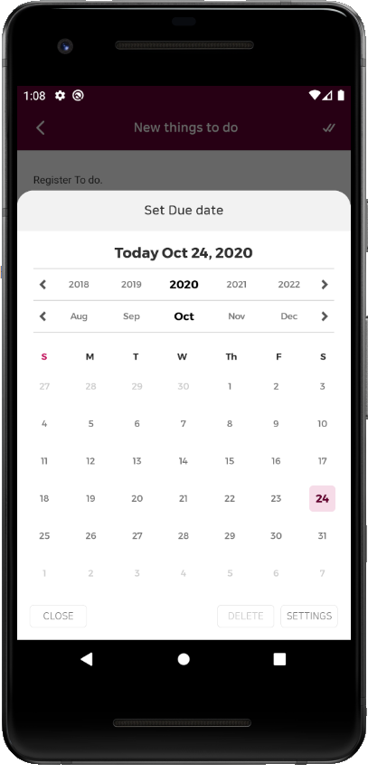

## PORT FOLIO

### Work Experience
* 회사 내부 프로젝트 4건, 외주 앱 유지보수 3건
    * 회사 내부 프로젝트 (All Native App)
      - Oops!  (To Do List 앱)
      - 스쿨북  (저학년생 대상 알림장 앱)
      - N메신저 (채팅 앱)
      - mDebugger (모바일 웹 디버깅 앱)
      
    * 외주 앱 유지보수 
      - KT 기프티쇼 (하이브리드 앱)
      - 한섬        (하이브리드 앱)
      - 시력검사 앱  (Native 앱)
   

### Skill (경험한 기술)
* Android (JAVA,Kotlin) 
  * Custom View (캘린더)
    - 커스텀 뷰를 제작하여 앱 시나리오에 맞게 구현
      
    
    
  * Retrofit2
    - JSON형식으로 서버와의 통신 및 응답코드별 동작을 처리
    - ex)(채팅 내용, 프로필 정보, 문의사항 전송...) CURD 요청 전송
    
  * Room DB (Android Jet Pack)
    - Entity(DTO)와 DAO를 통해 DB를 구현
    
  * Data Binding (Android Jet Pack)
    - findViewById()를 사용하지 않아도 뷰에 접근이 가능한 라이브러리 

  * Android Navigation (Android Jet Pack)
    - 1개의 Activity에 N개의 Fragment를 구현하는 구조로, 
      화면간의 관계 및 이동 그래프로 조작하여 쉽게 구현 가능한 라이브러리
  
  * Realm DB
    - IOS와 DB파일을 공유하기 위해, AOS & IOS 둘 다 지원하는 Realm DB를 사용
    - RealmObject(DTO)만을 구현하는 구조로 DB를 구현
    - Realm은 자동 갱신을 지원하여 빠른 속도 지원
    
  * Glide, Picasso
    - 이미지를 빠르고 효율적으로 불러올수있도록 사용
    - HttpUrlConnection, Volley, OkHttp등의 통신을 통해 서버에서 이미지를 바로 출력도 지원

  * Gson
    - 데이터를 Json으로 손쉽게 변환
    
  * Zxing
    - QR생성, QR스캔등의 라이브러리
  
  * OpenWeather
    - GeoCoder기반 날씨 라이브러리

* RxJava (현재 공부 중)
  -  비동기처리를 Observer 패턴으로 원만하게 하기위한 라이브러리
    

### Baek Algorithm Rank

### Github Status

  
### Most Language

